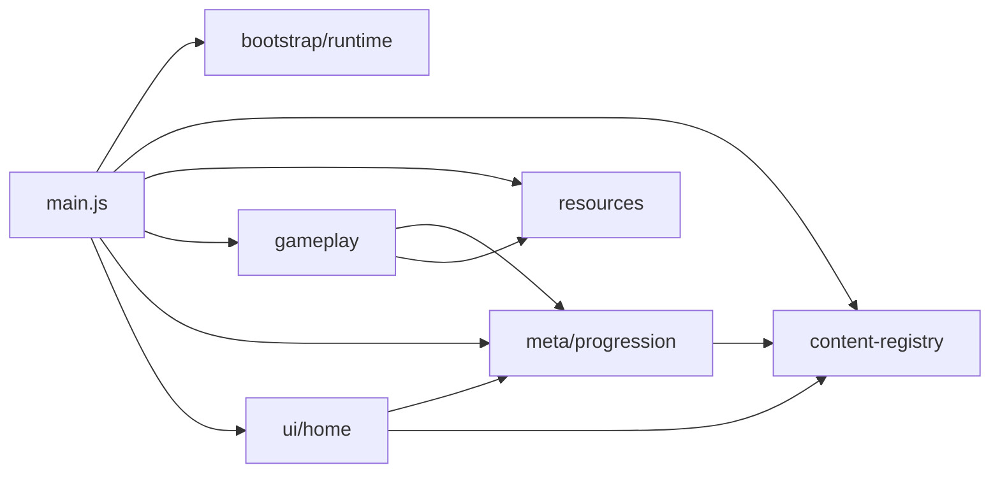

# 01. 当前架构与开发约束

这份文档是当前源码骨架的真相源，描述已经落地的 seam，而不是未来愿景。

## 1. 目录骨架

```text
web-runtime/src/
  bootstrap/
    runtime/
      query.js
      ui-shell.js
      mobile-shell-contract.js
  content-registry/
    themes.js
    index.js
    home-ui-contract.js
  gameplay/
    run-runtime.js
    run-events.js
    renderer.js
  meta/
    progression/
      build-planner.js
      meta-store.js
      quests-goals.js
      rewards-summary.js
  resources/
    assets.js
    asset-pipeline-contract.js
  ui/
    home/
      state.js
      controller.js
      renderers.js
      actions.js
      ui-assets.js
  main.js
```

### 1.1 已清理的废代码

- 已删除无调用方的根级 re-export facade：
  - `web-runtime/src/assets.js`
  - `web-runtime/src/build-planner.js`
  - `web-runtime/src/meta-store.js`
  - `web-runtime/src/quests-goals.js`
  - `web-runtime/src/rewards-summary.js`
  - `web-runtime/src/run-events.js`
  - `web-runtime/src/run-runtime.js`
  - `web-runtime/src/renderer.js`
  - `web-runtime/src/theme.js`
- 已删除无调用方的旧目录镜像：
  - `web-runtime/src/bootstrap/query.js`
  - `web-runtime/src/bootstrap/ui-shell.js`
  - `web-runtime/src/home/*`

当前运行代码只保留领域主路径，不再继续维护旧路径兼容层。

## 2. 运行口径

- 当前只支持竖屏移动端。
- `ui-shell` 统一锁定 `uiMode=mobile`，不再维护桌面分支行为。
- 桌面 HUD 和桌面洞府入口只保留兼容 DOM，不再作为真实交互路径。

## 3. 模块职责

### 3.1 `bootstrap/runtime`

- 负责 URL 启动参数、DOM 引用收集、移动端壳层切换、启动遮罩与入口 helper。
- 不承载玩法或局外业务。

### 3.2 `content-registry`

- 负责主题目录、内容 adapter、UI contract。
- `themes.js` 保留原始静态配置。
- `index.js` 对外暴露 battle / metaProgression / homeVisuals / debug 四类 adapter。
- 目标是降低调用方对大对象 `theme` 的宽接口依赖。

### 3.3 `gameplay`

- 负责战斗运行时、渲染、奇遇。
- 后续多人并发时，Boss、怪物、掉落、局内成长优先在这里分工。

### 3.4 `meta/progression`

- 负责局外成长、构筑、悬赏、奖励总结、元进度存档。
- 后续材料、升级、推荐逻辑优先在这里扩展。

### 3.5 `ui/home`

- 负责洞府 UI 状态、动作分发、HTML 渲染、UI 资产解析。
- 不直接跨层 import 战斗实现，优先通过上下文或回调拿能力。

### 3.6 `resources`

- 负责图片加载、预热、图片 URL helper、资源 contract。
- 测试与脚本应围绕这里的显式 contract 校验资源管线。

### 3.7 `main.js`

- 只做入口装配、依赖注入、事件绑定、主循环启动和调试桥接。
- 不再作为领域逻辑主要扩展面。

## 4. 依赖方向



约束：

- 优先通过工厂参数注入，不靠隐式全局。
- 新测试优先验证 contract，不再扫描 `main.js` 的实现字符串。
- `content-registry` 提供内容 adapter，减少大对象穿透。

## 5. 变更纪律

- 新功能先判断属于 `gameplay`、`meta/progression`、`ui/home`、`resources` 哪条 seam。
- 若未来再次引入兼容层，必须先证明存在真实调用方，再决定是否恢复薄 facade。
- 改目录骨架时同步更新：
  - `scripts/check-xianxia-config.mjs`
  - `scripts/test-xianxia-meta.mjs`
  - `scripts/test-xianxia-ui-assets.mjs`
  - `scripts/test-mobile-shell.mjs`
  - `scripts/smoke-web-runtime.mjs`
