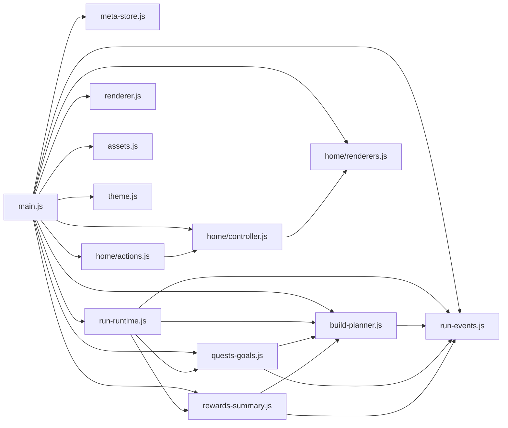

# 00 当前架构与开发约束

这份文档描述 `demo/src/` 现在已经落地的模块边界，不是未来愿景稿。

目标只有两个：

- 让后续开发知道功能该落在哪个模块。
- 防止 `main.js` 再次回滚成超大业务文件。

## 1. 当前目录

```text
demo/src/
  main.js
  theme.js
  assets.js
  renderer.js
  meta-store.js
  build-planner.js
  run-events.js
  quests-goals.js
  rewards-summary.js
  run-runtime.js
  home/
    state.js
    controller.js
    renderers.js
    actions.js
```

## 2. 模块职责

### `main.js`

入口壳。只负责：

- URL 参数解析
- DOM / canvas 引用收集
- 根级状态实例装配
- 模块依赖注入
- 事件绑定
- `loop()` 启动
- `window.demoGame` 调试桥接

禁止继续放入完整业务函数簇。

### `theme.js`

配置中心。负责：

- 主题数据
- 修仙 meta 配置
- 敌人、武器、章节、难度、Boss、成长项静态描述

不负责运行时逻辑。

### `assets.js`

资源层。负责：

- 图片 URL 选择
- 资源缓存与预热
- `img` HTML helper
- sprite 裁切辅助

### `renderer.js`

Canvas 渲染层。负责：

- 世界绘制
- 实体绘制
- 粒子、飘字、Boss 预警、摇杆等表现

只读 `game`，不直接改业务状态。

### `run-runtime.js`

战斗运行时总模块。负责：

- 开局、暂停、继续、结算
- 玩家移动与闪避
- 敌人、Boss、投射物、拾取物、经验、特效
- HUD 运行中刷新
- 调试场景入口

这是当前最大的业务模块，但它已经从入口层隔离出来。

### `run-events.js`

奇遇系统。负责：

- 奇遇配置解析
- 奇遇选择面板
- 伏击、试炼、祝福、连锁、秘径
- 奇遇事件记录
- 奇遇奖励与掉落

### `build-planner.js`

局外构筑与章节规划。负责：

- 开局构筑选择
- 预设、推荐、补短板方案
- 章节战备评估
- 材料缺口与刷取路线
- 组合图鉴与组合应用
- 局外升级成本与效果摘要

### `quests-goals.js`

悬赏与目标链路。负责：

- 悬赏进度
- 局内目标
- goal toast
- 旅程建议
- 结果页下一步建议

### `rewards-summary.js`

结算与摘要。负责：

- 局后奖励计算展示
- 奖励来源拆解
- 伤害来源拆解
- 暂停面板构筑摘要
- 首通奖励摘要

### `meta-store.js`

局外存档与元进度。负责：

- 默认存档结构
- `sanitize/load/save/import/export`
- 章节/难度/解锁/货币
- debug meta 注入

### `home/*`

洞府 UI 子系统：

- `state.js`：页签状态、焦点材料、预览难度等轻状态
- `controller.js`：面板开关、刷新、徽标
- `renderers.js`：洞府 HTML 渲染
- `actions.js`：洞府点击动作分发

## 3. 依赖方向

当前推荐依赖方向：



约束：

- 依赖通过工厂参数注入，不靠隐式全局。
- 模块之间允许通过回调拿能力，但不要反向 `import` 形成环。
- `renderer.js` 只做渲染，不做玩法决策。
- `theme.js` 只放静态配置，不放运行中状态。

## 4. 后续开发落点

### 新增战斗玩法

例如：

- 新敌人行为
- 新 Boss 技能
- 新投射物
- 新战斗掉落

优先落在：

- `run-runtime.js`
- `run-events.js`
- `renderer.js`
- `theme.js`

### 新增洞府页签或局外卡片

优先落在：

- `home/state.js`
- `home/renderers.js`
- `home/actions.js`
- 必要时补 `build-planner.js` / `meta-store.js`

### 新增局外成长系统

优先落在：

- `meta-store.js`
- `build-planner.js`
- `quests-goals.js`
- `rewards-summary.js`

### 新增调试参数

优先落在：

- `main.js` 只解析参数并注入
- 真正行为放 `run-runtime.js` 或对应域模块

不要把调试实现重新塞回入口。

## 5. 开发约束

### 约束一：`main.js` 不能回流业务

满足以下任一条件的代码，不应新增到 `main.js`：

- 需要 3 个以上业务字段才能工作
- 包含一整条玩法流程
- 包含一组同领域函数
- 可被其他模块复用

### 约束二：新模块继续走 factory

统一使用：

- `createXxx({...deps})`

不要引入单例模块状态，也不要在模块内偷偷读 DOM 全局。

### 约束三：上下文由聚合层输出

洞府渲染需要的新能力，优先通过 `getHomeRenderContext()` 聚合暴露。

不要让 `home/renderers.js` 直接跨层 import 运行时模块。

### 约束四：配置检查和 smoke 必须同步更新

只要模块边界变了，就同步更新：

- `scripts/check-xianxia-config.mjs`
- `scripts/smoke-demo.mjs`

否则验证脚本会继续拿旧架构做假设。

## 6. 推荐扩展顺序

后续如果还要继续细拆，建议顺序：

1. `run-runtime.js` 内部再拆 `player / enemies / boss / combat-flow`
2. 洞府渲染从 `home/renderers.js` 再拆页签文件
3. `theme.js` 抽 schema 或按主题目录拆分

不建议现在继续拆 `main.js`，因为入口层已经收口到可维护范围。

## 7. 变更前检查

改架构前先问自己：

- 这段逻辑是入口装配，还是领域逻辑？
- 是否已经存在更合适的域模块？
- 改完后 `main.js` 是否仍然只承担入口职责？
- `config:check` 和 `smoke` 的架构假设是否需要同步更新？

## 8. 当前基线

本轮模块化后的基线：

- `main.js` 约 `1092` 行
- `run-runtime.js` 约 `1484` 行
- 其余领域模块均已独立成文件

这套边界已经足够支撑后续继续开发，不需要再回到“大主文件 + 局部补丁”的模式。
